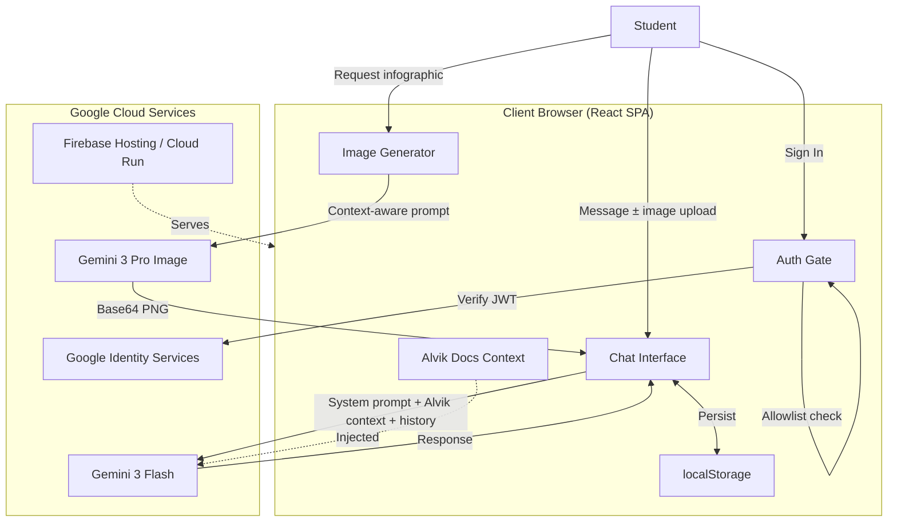

# CipherWolf — Master Architecture Plan

**Version:** 1.0  
**Date:** January 2026  
**Status:** Final Draft

---

## 1. Executive Summary

CipherWolf is a client-side Single Page Application (SPA) serving as an AI-powered tutor for a small group of 3 teenage learners. The curriculum focuses on:

- MicroPython programming
- Arduino & the **Alvik robot**
- Internet of Things (IoT)
- Robotics & drones

The system combines Google's **Gemini 3 Flash** for conversational tutoring and **Gemini 3 Pro Image** for generating infographics. Access is restricted to pre-approved Google accounts. The pedagogical approach is **LearnLM-inspired but direct**—CipherWolf answers questions immediately, then offers scaffolding for deeper exploration.

---

## 2. Technology Stack

| Layer | Technology |
|-------|------------|
| Frontend | React 19 (TypeScript) |
| Styling | Tailwind CSS (dark mode, hacker wolf aesthetic) |
| Authentication | Google Identity Services (GSI) |
| AI Chat | `gemini-3-flash-preview` via `@google/genai` SDK |
| AI Images | `gemini-3-pro-image-preview` |
| Icons | Lucide React |
| Persistence | Browser localStorage |
| Hosting | Google Cloud (Firebase Hosting or Cloud Run) |
| Runtime | Browser-based ES Modules (importmap) |

---

## 3. Architecture Diagram



---

## 4. Module Specifications

### 4.1 Authentication & Access Control

| Concern | Implementation |
|---------|----------------|
| Provider | Google Sign-In (GSI client library, loaded dynamically) |
| Flow | Render "Sign in with Google" button → receive JWT → decode client-side |
| Allowlist | Hardcoded `ALLOWED_EMAILS` array in `constants.ts` |
| Rejection | Friendly "Access not authorized" message for unlisted emails |
| States | `idle` · `authenticated` · `unauthorized` · `missing_config` |

### 4.2 Chat Engine (`geminiService.ts`)

| Concern | Implementation |
|---------|----------------|
| Model | `gemini-3-flash-preview` |
| Persona | "CipherWolf" — friendly tech-wolf mentor |
| System prompt | LearnLM-inspired, direct-first pedagogy (see §6) |
| History | React state array, persisted to localStorage |
| Image input | User uploads photos (circuits, errors) as base64 attachments |
| Code handling | Syntax-highlighted MicroPython/Arduino blocks via `MarkdownMessage.tsx` |

### 4.3 Image Generator (`imageService.ts`)

| Concern | Implementation |
|---------|----------------|
| Model | `gemini-3-pro-image-preview` |
| Trigger | User clicks "Generate Infographic" icon |
| Prompt strategy | Extract last 3 messages → wrap in meta-prompt requesting "high-tech blueprint / sci-fi schematic" style |
| Output | Base64 PNG rendered inline as `` in chat bubble |

### 4.4 Alvik Knowledge Module

| Concern | Implementation |
|---------|----------------|
| Source | Arduino Alvik official docs, API reference, example sketches |
| Format | Curated Markdown snippets embedded in system prompt |
| Coverage | API overview, sensor functions (`get_line_sensors()`, `get_distance()`, etc.), motor control (`drive()`, `rotate()`), common patterns (line following, obstacle avoidance, remote control) |

### 4.5 Persistence (`storageService.ts`)

| Concern | Implementation |
|---------|----------------|
| Engine | Browser `localStorage` |
| Schema | `{ odisn: string, history: Message[], timestamp: number }` |
| Limits | Auto-prune conversations older than 30 days or exceeding 100 messages |

---

## 5. User Interface

### 5.1 Visual Aesthetic

- **Theme:** Dark mode with neon accents (cyan `#00FFFF`, magenta `#FF00FF`, electric blue `#0080FF`)
- **Vibe:** Boyish hacker / cyberpunk / tech-wolf
- **Mascot:** Stylized wolf avatar for CipherWolf responses
- **Typography:** Monospace for code, clean sans-serif for prose

### 5.2 Screens

#### Login Gate
- Centered card with CipherWolf logo + tagline ("Your AI Pack Leader for Robotics 🐺")
- "Sign in with Google" button (outline style)
- Error state for unauthorized emails

#### Chat View
| Element | Description |
|---------|-------------|
| Header | CipherWolf branding, user avatar, sign-out button |
| Message stream | User bubbles (right, dark), CipherWolf bubbles (left, accent border) |
| Input area | Text field, image upload button (📎), infographic button (🖼️), send button |
| Sidebar | Learning phases, quick challenge shortcuts, conversation history list |

### 5.3 Components

| Component | Responsibility |
|-----------|----------------|
| `App.tsx` | Root controller; auth state, sidebar toggle, global chat state |
| `LoginGate.tsx` | Renders GSI button, handles auth flow |
| `ChatInterface.tsx` | Message stream, loading states, error handling |
| `MarkdownMessage.tsx` | Safe Markdown rendering, syntax highlighting |
| `InputArea.tsx` | Text input, file upload, infographic trigger |
| `Sidebar.tsx` | Phase navigation, challenge suggestions, history browser |

---

## 6. System Prompt Design

### 6.1 Core Principles

1. **Direct answers first.** When the user asks a question, provide a complete, working answer immediately.
2. **Scaffold second.** After answering, offer to explain *why* it works or suggest experiments.
3. **Age-appropriate tone.** Casual, encouraging, occasional wolf puns ("Let's pounce on this bug 🐺").
4. **Alvik expertise.** Reference Alvik API functions accurately; provide runnable code snippets.
5. **Guardrails.** Decline inappropriate requests; stay on-topic (STEM, robotics, coding).

### 6.2 Example System Instruction (Abridged)

```text
You are CipherWolf, a friendly AI tutor who helps a 13-year-old learn MicroPython, Arduino, the Alvik robot, IoT, and robotics.

PERSONALITY:
- Encouraging, patient, and fun
- Use casual language and occasional wolf-themed humor
- Celebrate successes ("Nice work, that's some alpha-level code!")

TEACHING STYLE:
- Answer questions directly and completely FIRST
- Provide working code when asked
- AFTER answering, offer one follow-up: explain concepts, suggest experiments, or ask if they want to go deeper
- Break complex topics into small steps when teaching new concepts
- Use analogies a teenager would understand

ALVIK KNOWLEDGE:
[Embedded Alvik API reference and common patterns here]

BOUNDARIES:
- Stay on topic (robotics, coding, electronics, STEM)
- No inappropriate content
- If unsure, say so honestly
```

---

## 7. Data Flow

```text
┌─────────────────────────────────────────────────────────────────┐
│ 1. INITIALIZATION                                               │
│    User loads app → Check localStorage for session              │
│    If no session → Show Login Gate                              │
│    If session exists → Validate, load history, show Chat View   │
└─────────────────────────────────────────────────────────────────┘
                                 │
                                 ▼
┌─────────────────────────────────────────────────────────────────┐
│ 2. AUTHENTICATION                                               │
│    User clicks "Sign in with Google"                            │
│    GSI returns JWT → Decode → Extract email                     │
│    Check email against ALLOWED_EMAILS                           │
│    If allowed → Store session, init Gemini client               │
│    If denied → Show "unauthorized" message                      │
└─────────────────────────────────────────────────────────────────┘
                                 │
                                 ▼
┌─────────────────────────────────────────────────────────────────┐
│ 3. CHAT INTERACTION                                             │
│    User types message (± attaches image)                        │
│    → Append to local state                                      │
│    → Send to Gemini 3 Flash (system prompt + Alvik context +    │
│      conversation history)                                      │
│    → Stream response → Render Markdown                          │
│    → Persist updated history to localStorage                    │
└─────────────────────────────────────────────────────────────────┘
                                 │
                                 ▼
┌─────────────────────────────────────────────────────────────────┐
│ 4. IMAGE GENERATION (on demand)                                 │
│    User clicks "Generate Infographic"                           │
│    → Extract last 3 messages as context                         │
│    → Build meta-prompt (high-tech schematic style)              │
│    → Call Gemini 3 Pro Image                                    │
│    → Receive Base64 PNG → Render in chat bubble                 │
└─────────────────────────────────────────────────────────────────┘
```

---

## 8. Configuration

### 8.1 `constants.ts`

```ts
// OAuth
export const GOOGLE_CLIENT_ID = "YOUR_CLIENT_ID.apps.googleusercontent.com";

// Access Control
export const ALLOWED_EMAILS = [
  "nephew@example.com",
  "friend1@example.com",
  "friend2@example.com",
];

// Gemini API
export const GEMINI_API_KEY = import.meta.env.VITE_GEMINI_API_KEY;

export const MODELS = {
  chat: "gemini-3-flash-preview",
  image: "gemini-3-pro-image-preview",
} as const;

// Pedagogy
export const SYSTEM_INSTRUCTION = `
You are CipherWolf...
[Full system prompt here]
`;

// Alvik Context (or import from separate file)
export const ALVIK_CONTEXT = `
## Alvik Robot API Reference
...
`;
```

### 8.2 Environment Variables (`.env`)

```text
VITE_GEMINI_API_KEY=your_gemini_api_key_here
```

### 8.3 `metadata.json`

```json
{
  "name": "CipherWolf",
  "version": "1.0.0",
  "permissions": []
}
```

---

## 9. Hosting & Deployment

| Concern | Plan |
|---------|------|
| Platform | Google Cloud — Firebase Hosting (preferred) or Cloud Run |
| Build | `npm run build` → static assets |
| Deploy | `firebase deploy` or `gcloud run deploy` |
| Domain | Custom domain via Firebase Hosting (optional) |
| SSL | Automatic via Firebase/Cloud Run |
| CI/CD | GitHub Actions → build → deploy on push to `main` |

### Firebase Hosting Setup (Quick Start)

```bash
npm install -g firebase-tools
firebase login
firebase init hosting
# Select project, set build output to "dist"
npm run build
firebase deploy
```

---

## 10. Security Considerations

| Risk | Mitigation |
|------|------------|
| Unauthorized access | Email allowlist enforced client-side; API keys not exposed to unauthorized users |
| API key exposure | Store in environment variables; keys only used after auth |
| XSS | React's default escaping; sanitize Markdown rendering |
| Prompt injection | System prompt instructs model to stay on-topic; no sensitive operations |
| localStorage tampering | Non-critical data only (chat history); auth re-validated on load |

---

## 11. Future Enhancements (Out of Scope for v1)

- Voice input/output
- Multi-device sync (Firestore)
- Progress tracking & badges
- Code execution sandbox (run MicroPython in browser)
- Integration with Arduino IDE / Alvik simulator

---

## 12. File Structure

```text
cipherwolf/
├── public/
│   └── index.html
├── src/
│   ├── components/
│   │   ├── App.tsx
│   │   ├── LoginGate.tsx
│   │   ├── ChatInterface.tsx
│   │   ├── MarkdownMessage.tsx
│   │   ├── InputArea.tsx
│   │   └── Sidebar.tsx
│   ├── services/
│   │   ├── geminiService.ts
│   │   ├── imageService.ts
│   │   └── storageService.ts
│   ├── context/
│   │   └── alvik-docs.md
│   ├── constants.ts
│   ├── types.ts
│   └── main.tsx
├── .env
├── package.json
├── tailwind.config.js
├── tsconfig.json
└── firebase.json
```

---

## 13. Summary

CipherWolf delivers a focused, engaging AI tutoring experience for young robotics learners. By combining direct instruction with optional scaffolding, leveraging Gemini's multimodal capabilities, and wrapping it in a "hacker wolf" aesthetic, the app aims to make learning MicroPython and the Alvik robot genuinely fun.

**Next steps:**
1. Curate Alvik documentation for context injection
2. Finalize system prompt language
3. Scaffold React project with Tailwind
4. Implement auth flow
5. Build chat interface
6. Integrate Gemini APIs
7. Deploy to Firebase Hosting
8. Test with target users

---

*"The pack learns together. Let's build something awesome." — CipherWolf 🐺*